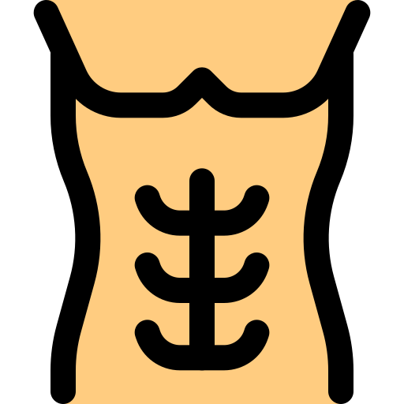

# **6cpsmidnight📝**

###  📖Dear whoever is reading this, I am 6cpsmidnight, but you can call me Midnight.

 

## 🌐I specialize in web development, I know how to use:

 

## 🛠️I am currently working on:

1. [Youtey](https://github.com/6cpsmidnight/Youtey "Youtey repository")
    
   

2. [eaganfarlinDOTcom](https://github.com/6cpsmidnight/eaganfarlinDOTcom "eaganfarlin.com repository")
    
   

 

## ⛱️My hobbies are:

-  Coding

-  M.M.A.

-  Calesthenics

 

## 💬If you would like to contact me:

- [ 6cpsmidnight](https://github.com/6cpsmidnight "my Github profile")

- [ farlineagan@gmail.com](mailto:farlineagan@gmail.com "my professional email")

-  midnight#1695

-   [eaganfarlin.com](https://eaganfarlin.com "my website")

 

### ✌️Thank you for reading this, I hope you have a good rest of your life!

 

### *Sincerely,*

### *Eagan (6cpsmidnight)*

 

#### Thanks to [Pixel Perfect](https://www.flaticon.com/authors/pixel-perfect), for making some of these icons, and to [Freepik](https://www.flaticon.com/authors/freepik), for making the [Files types icon pack](https://www.flaticon.com/packs/files-types-2) (specifically the linear color version used in this page), both of which are [Flaticon](https://flaticon.com/) authors.

 

#### Also thanks to [leart (@leart_alert)](https://giphy.com/leart_alert), a [Giphy](https://giphy.com) artist/designer.